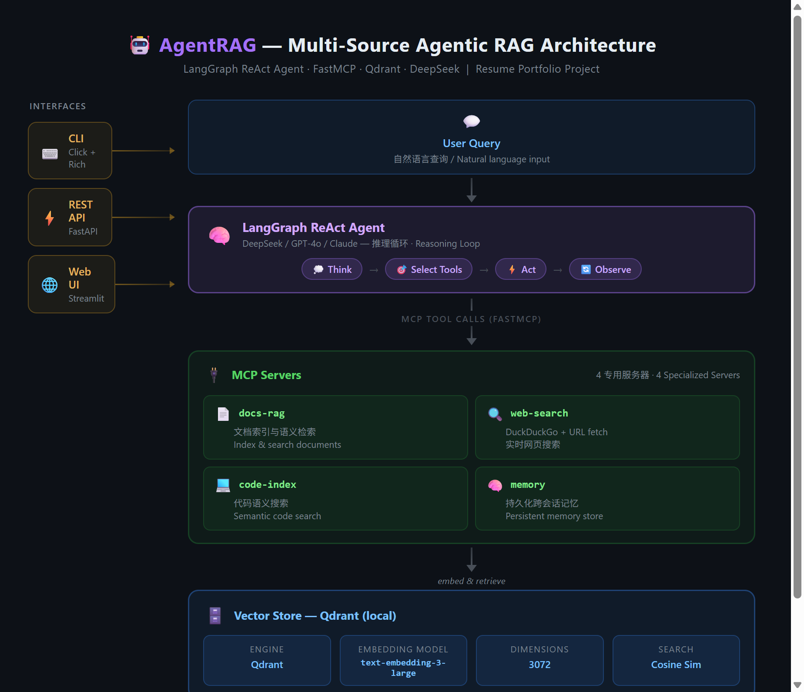

# AgentRAG — Multi-Source Agentic RAG with MCP

**English** | [中文](README.zh-CN.md)

An intelligent research assistant that combines **Retrieval-Augmented Generation** with an **autonomous agent** powered by **Model Context Protocol (MCP)**.

The agent reasons about your question, selects the right retrieval tools, fetches information from multiple sources, and synthesizes a coherent answer — all through a CLI, REST API, or Web UI.

## Architecture



> Interactive version: [docs/architecture.html](docs/architecture.html)

## Features

- **Multi-source retrieval**: Documents, code, web, and persistent memory
- **Autonomous agent**: LangGraph ReAct pattern — the agent decides which tools to use
- **MCP integration**: Tools exposed as MCP servers (FastMCP), composable and extensible
- **Multiple interfaces**: CLI (`click`), REST API (`FastAPI`), Web UI (`Streamlit`)
- **Flexible LLM backend**: Works with any OpenAI-compatible API (DeepSeek, GPT, Qwen, etc.)
- **Local vector store**: Qdrant in local mode — no external services needed

## Quick Start

```bash
# Clone and install
git clone https://github.com/URaux/agentrag.git
cd agentrag
pip install -e ".[dev]"

# Configure API keys
cp .env.example .env
# Edit .env with your API keys

# Index a document
agentrag index ./pyproject.toml --type doc

# Ask a question (agent auto-retrieves)
agentrag ask "What dependencies does this project use?"

# Search directly (no agent reasoning)
agentrag search "dependencies" --source docs

# Start the API server
agentrag serve
```

## CLI Commands

| Command | Description |
|---------|-------------|
| `agentrag ask <query>` | Ask the agent — it retrieves and reasons |
| `agentrag index <path>` | Index a file or directory |
| `agentrag search <query>` | Direct semantic search (no agent) |
| `agentrag serve` | Start REST API server |
| `agentrag status` | Show system status |

## REST API

```bash
# Start server
agentrag serve --port 8000

# Ask the agent
curl -X POST http://localhost:8000/ask \
  -H "Content-Type: application/json" \
  -d '{"query": "What is this project about?"}'

# Index a document
curl -X POST http://localhost:8000/index \
  -H "Content-Type: application/json" \
  -d '{"path": "./README.md", "doc_type": "doc"}'

# Direct search
curl -X POST http://localhost:8000/search \
  -H "Content-Type: application/json" \
  -d '{"query": "dependencies", "source": "docs"}'
```

## MCP Servers

Each retrieval source runs as an independent MCP server:

| Server | Tools | Description |
|--------|-------|-------------|
| `docs-rag` | `index_document`, `search_documents`, `list_indexed` | Index and search local documents |
| `web-search` | `web_search`, `fetch_page` | Real-time web search via DuckDuckGo |
| `code-index` | `index_repo`, `search_code` | Semantic code repository search |
| `memory` | `save_memory`, `recall`, `list_memories` | Persistent conversation memory |

## Tech Stack

- **Agent**: LangGraph (ReAct pattern)
- **LLM**: Any OpenAI-compatible API
- **MCP**: FastMCP 2.x
- **Vector Store**: Qdrant (local mode)
- **Embeddings**: text-embedding-3-large (3072 dim)
- **CLI**: Click + Rich
- **API**: FastAPI + Uvicorn
- **Web UI**: Streamlit

## Configuration

All settings via environment variables (prefix `AGENTRAG_`):

| Variable | Default | Description |
|----------|---------|-------------|
| `AGENTRAG_API_KEY` | — | LLM API key |
| `AGENTRAG_API_BASE` | `https://api.deepseek.com/v1` | LLM API base URL |
| `AGENTRAG_MODEL` | `deepseek-chat` | Chat model name |
| `AGENTRAG_EMBEDDING_API_KEY` | — | Embedding API key (falls back to API_KEY) |
| `AGENTRAG_EMBEDDING_API_BASE` | — | Embedding API base (falls back to API_BASE) |
| `AGENTRAG_EMBEDDING_MODEL` | `text-embedding-3-large` | Embedding model |

## License

MIT
